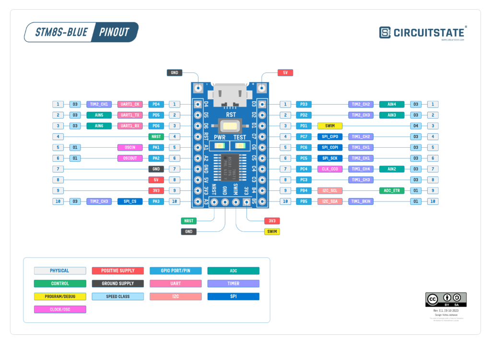

# Интерфейс ввода/вывода общего назначения (GPIO)

Интерфейс ввода/вывода общего назначения позволяет совершать низкоуровневый обмен сигналами с внешними устройствами.

|  |
| ------------------------------------- |

## Типы данных

### gpio_t
Структура, которая состоит 5 регистров конфигурации пина определенного порта.

Доступно 6 портов для управления пинами, в действительности используется только 4 порта: 

- `GPIO_A` - A1, A2, A3;
- `GPIO_B` - B5;
- `GPIO_C` - C4, C5, C6, C7, C8;
- `GPIO_D` - D1, D2, D3, D4, D5, D6.

### gpio_level_t
Логический уровень пина.

- `LOW` - низкий (0);
- `HIGH` - высокий (1).

### gpio_direction_t
Вывод пина.

- `INPUT` - порт работает только на вход;
- `OUTPUT` - порт работает только на выход.

### gpio_input_config_t
Настройка входных пинов.

- `PULLUP_OFF` - без подтягивающего резистора;
- `PULLUP_ON` - подтягивающий резистор;
- `EXTERNAL_INTERRPUT_OFF` - без внешних прерываний;
- `EXTERNAL_INTERRPUT_ON` - реагирование на внешние прерывания.

### gpio_output_config_t
Настройка выходных пинов.

- `OPEN_DRAIN` - псевдо открытый сток;
- `PUSH_PULL` - двухтактный выход;
- `LOW_SPEED` - скорость 2 МГц;
- `HIGH_SPEED` - скорость 10 МГц;

## Методы

**Установить уровень напряжения**
```c
error_t gpio_level_set(gpio_t *gpio, unsigned char pin, gpio_level_t level);
```

**Установить направление пина**
```c
error_t gpio_direction_set(gpio_t *gpio, unsigned char pin, gpio_direction_t direction);
```

**Настройка конфигурации пина на вход**
```c
error_t gpio_input_config_set(gpio_t *gpio, unsigned char pin, gpio_input_config_t value_1, gpio_input_config_t value_2);
```

**Настройка конфигурации пина на выход**
```c
error_t gpio_output_config_set(gpio_t *gpio, unsigned char pin, gpio_output_config_t value_1, gpio_output_config_t value_2);
```

## Пример кода
Пример кода мигания светодиодом.

```c
#include "gpio.h"

void delay(const unsigned long time)
{
    unsigned long i;
    for (i = 0; i < time; i++)
        ;
}

error_t main(void)
{
    (void)gpio_direction_set(GPIO_B, 5, OUTPUT);
    (void)gpio_level_set(GPIO_B, 5, HIGH);

    while (1)
    {
        (void)gpio_level_set(GPIO_B, 5, LOW);
        delay(200000);
        (void)gpio_level_set(GPIO_B, 5, HIGH);
        delay(200000);
    }
}
```