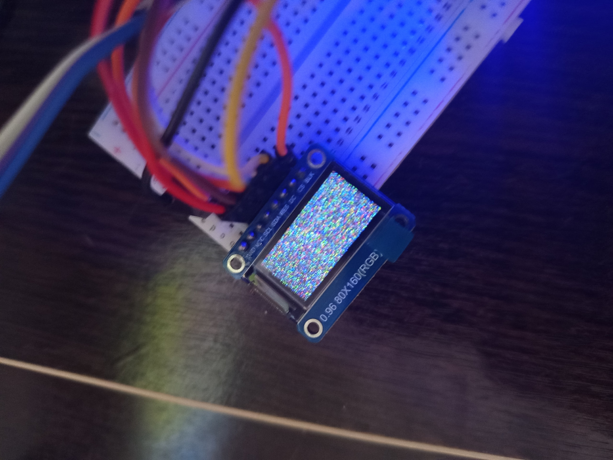

# Последовательный периферийный интерфейс (SPI)

SPI-интерфейс позволяет реализовать полудуплексный или полнодуплексный, синхронный обмен последовательными данными с внешними устройствами.

## Подключение

STM8S103F3P6 имеет только одну шины SPI:

| Пин | Назначение                                            |
| --- | ----------------------------------------------------- |
| C7  | Ведущий Принимает - Ведомый Отправляет (MISO / CIPO)  |
| C6  | Ведущий Отправляет - Ведомый Принимает (MOSI / COPI)  |
| C5  | Синхронизация (SCLK)                                  |

Для пинов Chis Select/Slave Select (CS/SS) и Data/Command (DS) можно выбрать любой цифровой или аналоговый пин.

## Типы данных

### spi_mode_t
Выбор в каком режиме работает SPI.

- `SPI_MODE_SLAVE` - Режим работы как ведомый;
- `SPI_MODE_MASTER` - Режим работы как ведущий.

### spi_baudrate_t
Скорость передачи данных определяется по формуле:  

$\dfrac{F_{cpu}}{n}$

Где:

- $F_{cpu}$ - Частота процессора микроконтроллера
- $n$ - Коэффициент деления

Доступные коэффициенты:
- `SPI_BAUDRATE_2`;
- `SPI_BAUDRATE_8`;
- `SPI_BAUDRATE_16`;
- `SPI_BAUDRATE_32`;
- `SPI_BAUDRATE_64`;
- `SPI_BAUDRATE_128`;
- `SPI_BAUDRATE_256`.

### spi_frame_t
Режим отправки данных.
- `SPI_FRAME_FORMAT_MSB` - Старший бит отправляется первым;
- `SPI_FRAME_FORMAT_LSB` - Младший бит отправляется первым.

### spi_transaction_t
Выбор типа данных.
- `SPI_TRANSACTION_DATA` - Отправить как данные;
- `SPI_TRANSACTION_COMMAND` - Отправить как команду.

### spi_device_t
Структура, которая хранит порты и пины устройства.
- `gpio_t *gpio_cs;`  - Порт, где находится пин Chip Select (CS)
- `gpio_t *gpio_dc;`  - Порт, где находится пин Data/Command (DC)
- `unsigned char cs;` - Номер пина Chip Select (CS)
- `unsigned char dc;` - Номер пина Data/Command (DC)

## Методы

**Инициализация spi-шины**
```c
error_t spi_init(spi_mode_t mode, spi_baud_rate_t baud, spi_frame_format_t frame);
```

**Включить SPI-интерфейс**
```c
error_t spi_enable(void);
```

**Отправить данные на девайс**
```c
error_t spi_send(spi_device_t *device, spi_transaction_t type, unsigned char data);
```

**Чтение данных с девайса**
```c
unsigned char spi_read(spi_device_t *device, unsigned char data);
```

**Выключить SPI-интерфейс**
```c
error_t spi_disable(void);
```

**Деинициализация SPI-интерфейса**
```c
void spi_deinit(void);
```

## Пример кода

В данном примере - инициализация SPI-шины и дисплея с контроллером ST7735S при помощи методов для отправки данных.

```c
#include "gpio.h"
#include "spi.h"

error_t main(void)
{
    spi_device_t device = {
        .gpio_cs = GPIO_D,
	    .gpio_dc = GPIO_D,
	    .cs = 5,
    	.dc = 6
    };

    (void)gpio_direction_set(GPIO_D, device.dc, OUTPUT);
    (void)gpio_direction_set(GPIO_D, device.cs, OUTPUT);
    (void)gpio_level_set(GPIO_D, device.cs, HIGH);
    (void)spi_init(SPI_MODE_MASTER, SPI_BAUD_RATE_8, SPI_FRAME_FORMAT_MSB);
    (void)spi_enable();

    /*
     * Transmitted commands:
     * 1. Software Reset 
     * 2. Gamma Set
     * 3. Sleep Out & Booster On
     * 4. Display on 
     */

    assert(spi_send(&device, SPI_TRANSACTION_COMMAND, 0x01) == OK);
    assert(spi_send(&device, SPI_TRANSACTION_COMMAND, 0x26) == OK);
    assert(spi_send(&device, SPI_TRANSACTION_COMMAND, 0x11) == OK);
    assert(spi_send(&device, SPI_TRANSACTION_COMMAND, 0x29) == OK);

    return OK;
}
```

## Результат
|  |
| ---------------------------------------- |
